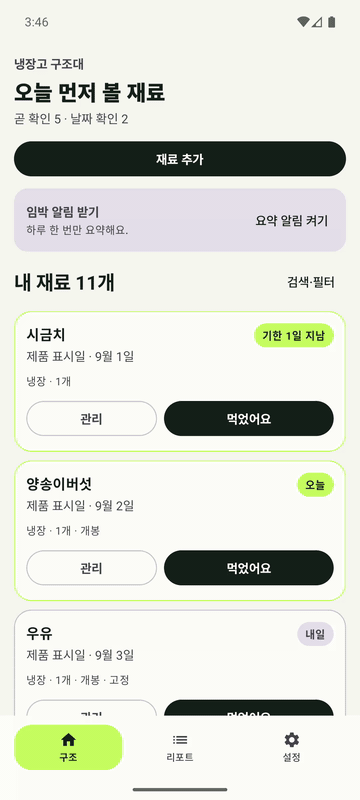
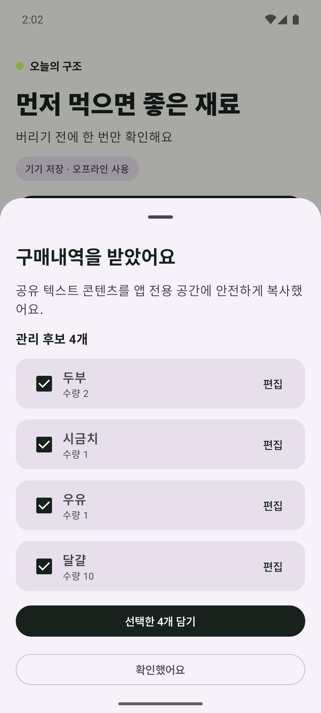
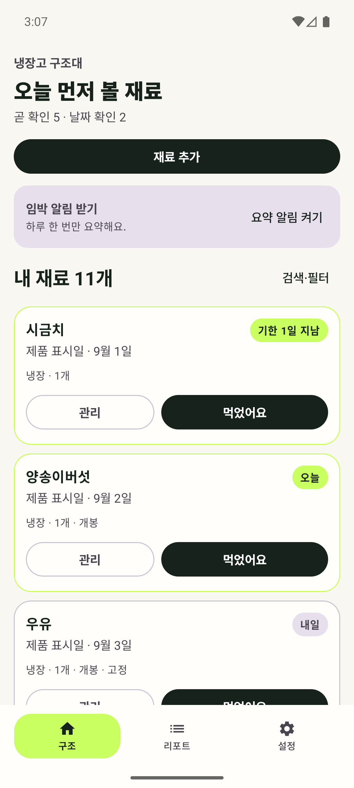
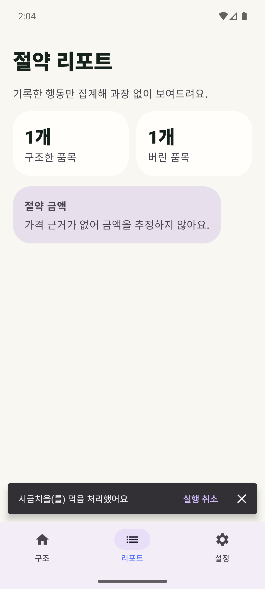

# 냉장고 구조대

> 등록은 가볍게, 소비 판단은 정확하게.

온라인 주문내역·영수증·바코드를 받아 식재료 후보를 자동으로 만들고, 먼저 먹어야 할 재료를 알려주는 로컬 우선 Android 앱입니다. 포트폴리오를 위한 화면 구현에 그치지 않고 데이터 복구, 예외 처리, 접근성, 알림, 릴리스 최적화와 성능 측정까지 제품 단위로 완성했습니다.

<p align="center">
  
</p>

<p align="center">
  <a href="docs/assets/fridge-rescue-demo.mp4">12초 원본 데모 영상</a>
</p>

## 해결하려는 문제

냉장고 관리 앱은 재료를 하나씩 입력하는 순간 이탈하기 쉽습니다. 냉장고 구조대는 등록 비용을 줄이는 데 집중합니다.

1. 쇼핑 앱에서 주문내역을 공유하거나 종이 영수증·바코드를 읽습니다.
2. 식품 후보와 수량을 기기 안에서 추출하고, 애매한 항목은 사용자 확인 대상으로 남깁니다.
3. 표시기한과 앱 예상 소비일을 구분해 과장 없이 구조 우선순위를 만듭니다.
4. 먹음·일부 사용·버림 기록으로 리포트와 다음 장보기 힌트를 제공합니다.

## 핵심 화면

| 구매내역 검토 | 구조 큐 | 행동 기반 리포트 |
|---|---|---|
|  |  |  |

## 제품 판단

- 자동화가 틀릴 수 있음을 전제로 후보 선택·인라인 편집·직접 입력 대체 경로를 항상 제공합니다.
- 제조사 표시 날짜, 사용자가 확정한 날짜, 앱 예상 소비일을 같은 의미처럼 보여주지 않습니다.
- 같은 이름의 재료를 임의로 합치지 않고 중복 가능성을 경고합니다.
- 가격 근거가 없으면 절약 금액을 만들지 않고, 실제 기록한 행동만 집계합니다.
- 영수증 이미지와 재료 데이터는 기본적으로 기기에 보관하며 전체 삭제를 명시적으로 제공합니다.

## 구현 범위

- Android Sharesheet 텍스트·이미지·PDF 수신과 프로세스 종료 후 초안 복구
- ML Kit 한국어 온디바이스 OCR, Google Code Scanner 일반·GS1 바코드, `PdfRenderer`, Photo Picker, 영수증 카메라
- 식품·비식품 규칙 기반 분류, 수량 추출, 후보 편집, 재공유·기존 재료 중복 경고, 일괄 저장
- Room 구조 큐, 표시 날짜와 예상일 분리, 검색·보관 위치·상태 필터
- 먹음·아직 있음·일부 사용·버림 이력, 선택 폐기 사유, 멱등 처리와 실행 취소
- WorkManager 기한 경과·D-3·D-1·당일 요약 알림, 앱바 알림함, 알림 직접 행동, 조용한 시간
- 구조·폐기 리포트와 반복 폐기 장보기 힌트
- 전체 로컬 데이터 삭제, 시스템 다크 모드, 폰·넓은 화면 적응형 Compose UI
- 선택형 익명 계정, 초대 코드 가족 참가, Ktor 서버와 결정적 최신 변경 우선 동기화

## 기술 구성

- Kotlin 2.3, Jetpack Compose Material 3, Clean Architecture, UDF, Hilt, ViewModel, Coroutine·StateFlow
- Room 2.8, WorkManager 2.11, Preferences DataStore 1.2
- ML Kit Text Recognition v2 한국어 번들 모델, Google Code Scanner 16.1
- Android 8.0(API 26) 이상, compile/target SDK 36, JDK 17
- R8·리소스 축소·외부 키 서명, Baseline Profile, Macrobenchmark, GitHub Actions
- Ktor 3.5, kotlinx.serialization, Bearer 인증, 원자적 JSON 서버 저장

```text
외부 공유·카메라·Photo Picker·바코드
                 ↓
앱 전용 캐시 → OCR/PDF/GS1 파싱 → 후보 분류·편집
                 ↓                    ↓
            24시간 정리          Room 일괄 저장
                                      ↓
                      구조 큐 → 행동 이력 → 알림·리포트
```

## 검증 근거

포트폴리오 시연용 식재료·이력·갤러리 사진은 [데모 데이터 가이드](./docs/DEMO_DATA.md)를 따라 한 명령으로 주입할 수 있습니다.

- 기능 자동 테스트 109개: 앱·서버 JVM 55개, Hilt·Room·Intent·Compose 계측 54개
- API 26과 API 36 에뮬레이터에서 전체 계측 테스트 통과
- TalkBack 실제 서비스 연결 후 클릭 요소 접근성 라벨 정적 감사 통과
- 재부팅 후 WorkManager 재등록, 강제 Doze 지연, 절전 모드 실행 확인
- 실제 생성 영수증 이미지에서 `두부 2개`, `시금치 1봉` OCR·선별 확인
- R8 최적화 서명 Release APK/AAB 생성과 서명 검증 완료
- Baseline Profile이 Release APK `assets/dexopt`에 포함됨을 검증
- API 36 에뮬레이터 참고 측정에서 콜드 스타트 중앙값 286.7ms → 268.2ms; 실기기 수치가 아님을 명시

```bash
./gradlew testDebugUnitTest lintDebug connectedDebugAndroidTest assembleRelease
```

## 문서

- [포트폴리오 사례 정리](./docs/PORTFOLIO.md)
- [구현 현황](./docs/IMPLEMENTATION_STATUS.md)
- [제품 기획서](./docs/PRODUCT_SPEC.md)
- [사용자 흐름](./docs/USER_FLOW.md)
- [Android Compose 구현 계획](./docs/ANDROID_PLAN.md)
- [예외처리 기준](./docs/EDGE_CASES.md)
- [테스트 케이스](./docs/TEST_CASES.md)
- [QA 결과](./docs/QA_REPORT_2026-09-02.md)
- [성능 측정](./docs/PERFORMANCE.md)
- [릴리스 가이드](./docs/RELEASE.md)
- [가족 공유·서버 동기화](./docs/FAMILY_SYNC.md)
- [데모 데이터·갤러리 사진](./docs/DEMO_DATA.md)
