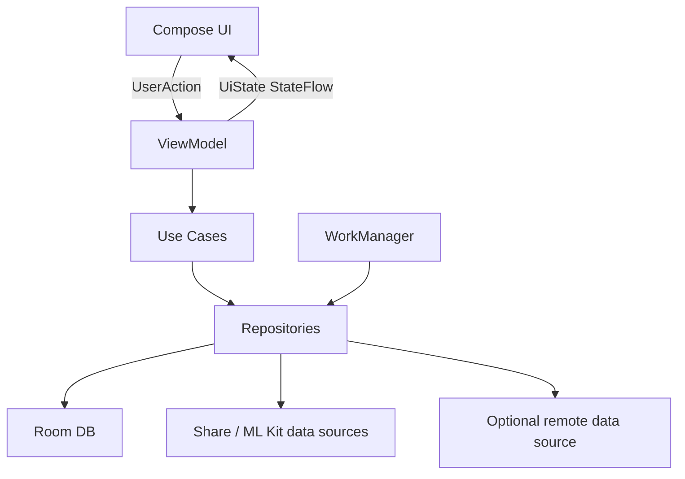
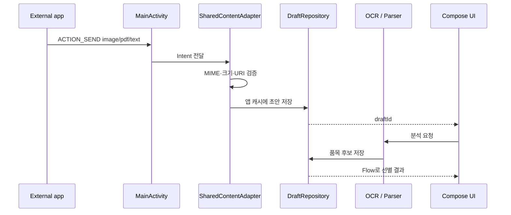

# Android Compose 구현 계획

## 1. 기술 목표

냉장고 구조대는 다음 Android 역량을 포트폴리오에서 설명할 수 있도록 설계한다.

- Compose 기반 상태 주도 UI
- 다른 앱과 연결되는 Android Sharesheet
- 온디바이스 문서 스캔·한국어 OCR·바코드 처리
- Room 단일 진실 공급원을 사용하는 offline-first 구조
- WorkManager 기반 신뢰 가능한 백그라운드 작업
- 프로세스 종료와 다양한 화면 크기에 대응하는 상태 복구
- 테스트 가능한 도메인 규칙과 데이터 계층

## 2. 현재 프로젝트 기준

| 항목 | 설정 |
|---|---|
| 언어 | Kotlin |
| UI | Jetpack Compose + Material 3 |
| 패키지 | `com.portfolio.fridgerescue` |
| 최소 SDK | API 26 |
| 컴파일·타깃 SDK | API 36 |
| JDK | 17 |
| 빌드 설정 | Kotlin DSL + Version Catalog |

구체적인 라이브러리 버전은 [`gradle/libs.versions.toml`](../gradle/libs.versions.toml)을 단일 기준으로 사용한다.

## 3. 아키텍처 원칙

Android 공식 아키텍처 권장사항을 바탕으로 UI와 데이터 계층을 분리한다.



### 필수 규칙

- Composable은 Repository, DAO, ML Kit, ContentResolver에 직접 접근하지 않는다.
- 화면은 불변 `UiState`를 입력받고 `UserAction`을 상위로 전달한다.
- ViewModel은 Android `Context`를 보관하지 않는다.
- Repository가 로컬·외부 입력 데이터를 조정한다.
- Room이 앱 데이터의 단일 진실 공급원이다.
- UI는 네트워크나 ML 작업의 성공을 낙관적으로 단정하지 않는다.

## 4. 모듈 계획

기능 구현을 시작할 때 다음 순서로 모듈을 추가한다. 비어 있는 모듈을 한꺼번에 만들지 않는다.

```text
:app
:core:model
:core:data
:core:designsystem
:core:testing
:feature:intake
:feature:rescue
:feature:report
:feature:settings
```

| 모듈 | 책임 | 의존 가능 대상 |
|---|---|---|
| `:app` | Activity, 앱 내비게이션, DI 조립 | 모든 feature |
| `:core:model` | 순수 Kotlin 도메인 모델 | 없음 |
| `:core:data` | Room, Repository, 외부 입력 어댑터 | `core:model` |
| `:core:designsystem` | 테마와 재사용 Compose 컴포넌트 | `core:model` 선택 |
| `:core:testing` | Fake와 테스트 fixture | `core:model`, `core:data` |
| `:feature:intake` | 공유 수신, OCR, 선별 결과 | core 모듈 |
| `:feature:rescue` | 홈, 목록, 상세, 상태 변경 | core 모듈 |
| `:feature:report` | 통계와 장보기 힌트 | core 모듈 |
| `:feature:settings` | 알림·개인정보·데이터 설정 | core 모듈 |

초기 수직 기능 하나가 완성되기 전에는 모듈 수보다 명확한 인터페이스와 테스트를 우선한다.

## 5. 패키지 구조

각 feature는 같은 구조를 사용한다.

```text
feature/intake/
├── navigation/
├── presentation/
│   ├── IntakeRoute.kt
│   ├── IntakeScreen.kt
│   ├── IntakeUiState.kt
│   └── IntakeViewModel.kt
├── domain/
│   └── ClassifyPurchaseItemsUseCase.kt
└── components/
```

- `Route`: ViewModel 수집과 내비게이션 연결
- `Screen`: 상태 없는 화면 렌더링
- `UiState`: 로딩·콘텐츠·부분 성공·실패 상태
- `ViewModel`: 사용자 행동 처리와 도메인 호출
- `components`: preview 가능한 작은 UI

## 6. 주요 라이브러리 계획

| 영역 | 계획 | 도입 시점 |
|---|---|---|
| UI | Compose, Material 3 | 설정 완료 |
| 상태 | Lifecycle ViewModel, StateFlow | 첫 feature |
| 내비게이션 | Navigation 3 또는 현재 안정 Compose Navigation | 화면 2개 이상 |
| DB | Room 2.8.4, KSP | 도입 완료 — 스키마 v1 |
| 설정 | Preferences DataStore | 알림 설정 |
| DI | Hilt | Repository와 Worker 연결 시점 |
| 백그라운드 | WorkManager | 임박 알림 |
| 문서 스캔 | ML Kit Document Scanner | 종이 영수증 기능 |
| OCR | ML Kit Korean Text Recognition v2 | 공유 이미지 분석 |
| 바코드 | ML Kit Barcode Scanning | P1 보조 입력 |
| 이미지 선택 | Android Photo Picker | 갤러리 입력 |

라이브러리는 기능이 시작될 때만 추가한다. 계획만으로 의존성을 미리 늘리지 않는다.

## 7. 도메인 모델

```kotlin
data class FoodItem(
    val id: FoodItemId,
    val name: String,
    val category: FoodCategory?,
    val quantity: Quantity?,
    val storage: StorageLocation,
    val date: FoodDate?,
    val openedAt: Instant?,
    val status: FoodStatus,
    val source: IntakeSource,
    val version: Long,
)
```

```kotlin
data class FoodDate(
    val value: LocalDate,
    val type: DateType,
    val source: DateSource,
    val confidence: Confidence,
)
```

### 주요 enum

```text
StorageLocation = REFRIGERATED | FROZEN | ROOM_TEMPERATURE
FoodStatus = ACTIVE | EXPIRING | EXPIRED | CONSUMED | DISCARDED | ARCHIVED
DateType = USE_BY | SELL_BY | BEST_BEFORE | DISPLAYED | ESTIMATED
DateSource = PACKAGE_OCR | GS1_BARCODE | USER | PURCHASE_ESTIMATE
Confidence = HIGH | MEDIUM | LOW
IntakeSource = SHARED_IMAGE | SHARED_PDF | SHARED_TEXT | RECEIPT_CAMERA | BARCODE | MANUAL
```

`LocalDate`와 `Instant`의 의미를 섞지 않는다. 포장 날짜는 `LocalDate`, 이벤트 발생 시각은 `Instant`로 저장한다.

## 8. Room 모델

### 테이블

| 테이블 | 역할 |
|---|---|
| `food_items` | 현재 식재료 상태 |
| `food_events` | 생성, 날짜 수정, 소비, 폐기, 되돌리기 이력 |
| `intake_drafts` | 공유·OCR 검수 중인 초안 |
| `intake_candidates` | 초안별 품목 후보와 선별 결과 |
| `notification_plans` | 품목별 알림 계획과 고유 작업 키 |

### 트랜잭션 경계

- 선별 후보 일괄 저장 + 생성 이벤트 기록
- 소비·폐기 상태 변경 + 이벤트 기록 + 알림 계획 비활성화
- 되돌리기 + 이전 상태 복원 + 알림 재계산
- 중복 항목 병합 + 원본 ID 이력 보존

상태 변경은 `operationId`를 받아 중복 호출을 무시할 수 있게 한다.

## 9. 공유 콘텐츠 처리



### Intent 규칙

- `ACTION_SEND`만 우선 지원하고 다중 파일은 P1으로 둔다.
- MIME 타입은 `text/plain`, `image/*`, `application/pdf`로 제한한다.
- `onCreate`와 `onNewIntent`를 동일 어댑터로 처리한다.
- 외부 URI 자체를 ViewModel이나 SavedStateHandle에 저장하지 않는다.
- URI를 앱 캐시에 복사한 뒤 최대 크기와 실제 파일 시그니처를 확인한다.
- 임시 파일은 분석 완료 또는 24시간 후 삭제한다.

## 10. Intake 파이프라인

각 단계를 인터페이스로 분리한다.

```text
SharedContentReader
→ DocumentTextExtractor
→ PurchaseLineParser
→ ProductNormalizer
→ WasteRiskClassifier
→ DateEstimator
→ IntakeCandidateRepository
```

### 결과 모델

```kotlin
sealed interface IntakeResult {
    data class Success(val draftId: String) : IntakeResult
    data class PartialSuccess(
        val draftId: String,
        val warnings: List<IntakeWarning>,
    ) : IntakeResult
    data class Failure(val reason: IntakeError) : IntakeResult
}
```

부분 성공을 실패로 버리지 않는다. 인식된 품목을 유지한 채 사용자가 직접 추가할 수 있게 한다.

## 11. UiState 설계

```kotlin
sealed interface IntakeUiState {
    data object Loading : IntakeUiState
    data class Content(
        val autoCandidates: List<CandidateUiModel>,
        val reviewCandidates: List<CandidateUiModel>,
        val excludedCount: Int,
        val isSaving: Boolean,
    ) : IntakeUiState
    data class PartialSuccess(
        val content: Content,
        val warning: UiMessage,
    ) : IntakeUiState
    data class Failure(
        val message: UiMessage,
        val recovery: RecoveryAction,
    ) : IntakeUiState
}
```

- 화면에 필요한 값만 UI 모델로 변환한다.
- 문자열 리소스 ID나 사용자 문구를 도메인 계층에 두지 않는다.
- Snackbar를 데이터 완료의 근거로 사용하지 않는다.
- 화면 전환 이벤트보다 저장된 데이터 상태를 우선한다.

## 12. 알림과 WorkManager

- 하루 단위 임박 알림에는 exact alarm을 사용하지 않는다.
- 품목별 계획을 DB에 저장하고 하루 요약 Worker가 현재 데이터를 다시 계산한다.
- 고유 작업 이름으로 중복 예약을 교체한다.
- Worker는 Repository를 통해서만 데이터를 변경한다.
- 소비·폐기 후 오래된 알림을 눌러도 최신 Room 상태를 보여준다.
- 알림 권한이 없으면 Worker는 알림을 보내지 않고 홈 배지만 유지한다.

```text
uniqueWorkName = fridge-rescue-daily-summary
foodAlertKey = foodItemId + alertType
```

## 13. 상태 복구

| 상태 | 저장 위치 |
|---|---|
| 화면의 검색어·필터 | SavedStateHandle |
| 공유 초안 ID와 현재 단계 | SavedStateHandle + Room |
| OCR 후보와 사용자 수정 | Room 초안 테이블 |
| 저장된 식재료와 이벤트 | Room |
| 알림·조용한 시간 설정 | DataStore |
| Snackbar 노출 여부 | 저장하지 않음 |

프로세스 종료 뒤에도 핵심 초안을 복구할 수 있어야 하며 대용량 Bitmap과 OCR 원문을 UI 상태에 담지 않는다.

## 14. 테스트 계획

상세 케이스와 요구사항 추적표는 [TEST_CASES.md](./TEST_CASES.md)를 기준으로 한다. 기능 구현과 해당 자동 테스트는 같은 작업 단위에서 작성한다.

### 단위 테스트

- 날짜 경계와 타임존
- 구조 우선순위
- 폐기 위험 분류 규칙
- 주문 취소·대체품 제외
- 상태 전이와 되돌리기
- operationId 멱등 처리
- 중복 후보 계산

### 데이터 테스트

- Room DAO와 마이그레이션
- 일괄 저장 트랜잭션
- 소비와 알림 취소의 원자성
- 삭제 tombstone과 오래된 수정
- Flow 갱신 순서

### Compose UI 테스트

- 자동 후보 선택·해제
- 빈 결과와 부분 성공
- 직접 입력 대체 경로
- 소비 완료와 되돌리기
- 알림 권한 거부 안내
- 큰 글자와 스크린리더 설명

### 계측 테스트

- 이미지·PDF·텍스트 ACTION_SEND
- 일시적 URI 권한
- 프로세스 종료 후 초안 복구
- WorkManager 고유 작업 교체
- ML Kit 미지원·모델 미다운로드 대체 흐름

### 성능 테스트

- cold start와 첫 프레임
- 식재료 1,000개 목록 스크롤
- 긴 영수증 이미지 메모리 사용량
- 선별 결과 100개 렌더링

## 15. 접근성·적응형 UI

- 폰은 단일 pane, 넓은 화면은 list-detail pane을 사용한다.
- 화면 크기 변경이 선택 항목과 검수 상태를 초기화하지 않아야 한다.
- 모든 아이콘 버튼에 의미 있는 content description을 제공한다.
- 임박도를 색상과 텍스트로 함께 표시한다.
- 48dp 터치 영역과 200% 글자 크기를 검증한다.
- 줄어든 모션 설정에서 불필요한 반복 애니메이션을 제거한다.

## 16. 보안과 개인정보

- 전체 사진 권한보다 Photo Picker와 공유 Intent를 우선한다.
- 카드번호, 승인번호, 주소, 결제 금액은 저장 대상이 아니다.
- OCR 원문과 영수증 이미지를 로그·분석 이벤트에 넣지 않는다.
- 캐시 파일 이름에 사용자나 상점 정보를 포함하지 않는다.
- 파일 크기, MIME, 시그니처를 검증한 뒤 디코딩한다.
- 원본 임시 파일은 자동 삭제하고 사용자가 데이터 삭제를 요청하면 초안도 함께 삭제한다.

## 17. 개발 순서

### Milestone 0 — 문서와 기반

- 제품·흐름·예외 문서 확정
- Compose 테마와 기본 앱 빌드
- CI와 정적 검사 기준 정의

### Milestone 1 — 로컬 구조 큐

- 도메인 모델과 Room
- 홈, 목록, 상세
- 먹음·아직 있음·버림·되돌리기
- 날짜와 우선순위 단위 테스트

### Milestone 2 — 공유해서 담기

- ACTION_SEND 수신
- 초안 저장과 복구
- 이미지·PDF·텍스트 파서
- 규칙 기반 자동 선별과 일괄 저장

### Milestone 3 — 촬영·알림

- Document Scanner와 한국어 OCR
- 바코드 보조 입력
- WorkManager 요약 알림
- 알림 권한 거부 대안

### Milestone 4 — 리포트·완성도

- 소비·폐기 통계
- 접근성·적응형 UI
- 성능 측정과 Baseline Profile
- README, 아키텍처 다이어그램, 데모 영상

## 18. 시작 전 결정 게이트

기능 구현 전 다음 항목을 확정한다.

- [ ] 앱 이름과 패키지 ID 유지 여부
- [ ] 자동 선별 P0 카테고리 목록
- [ ] 카테고리별 예상 소비기간의 근거 데이터
- [ ] 첫 알림 권한 요청 시점
- [ ] 서버 없는 로컬 MVP 범위
- [ ] 앱 표시용 예상 날짜 안전 문구
- [ ] 초기 디자인 토큰과 다크 모드 방향
- [ ] CI에서 실행할 테스트·lint 명령

## 19. 공식 참고자료

- [Android 앱 아키텍처 권장사항](https://developer.android.com/topic/architecture/recommendations)
- [Android offline-first 가이드](https://developer.android.com/topic/architecture/data-layer/offline-first)
- [Compose에서 공유 콘텐츠 받기](https://developer.android.com/develop/ui/compose/sharing/receive)
- [ML Kit Document Scanner](https://developers.google.com/ml-kit/vision/doc-scanner/android)
- [ML Kit Text Recognition v2](https://developers.google.com/ml-kit/vision/text-recognition/v2)
- [ML Kit Barcode Scanning](https://developers.google.com/ml-kit/vision/barcode-scanning/android)
