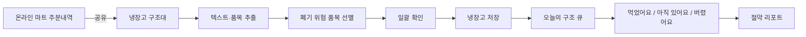

# 냉장고 구조대 제품 기획서

## 1. 한 문장 정의

> 온라인 주문내역이나 영수증을 공유하면 버리기 쉬운 식재료만 골라주고, 오늘 무엇부터 먹어야 하는지 알려주는 Android 앱.

## 2. 해결하려는 문제

기존 냉장고 관리 앱은 사용자가 모든 식재료의 이름, 수량, 보관 위치와 날짜를 계속 입력해야 한다. 입력이 멈추면 실제 냉장고와 앱의 목록이 달라지고 앱의 가치도 사라진다.

냉장고 구조대는 `정확한 전체 재고`보다 다음 문제에 집중한다.

- 냉장고 안의 임박 재료를 잊는다.
- 같은 식재료를 다시 구매한다.
- 무엇부터 먹어야 할지 판단하기 어렵다.
- 기록 과정이 번거로워 관리 앱을 오래 사용하지 못한다.

## 3. 제품 가설

구매 직후 주문내역을 한 번 공유하고 앱이 관리할 품목을 자동 선별한다면, 사용자는 품목별 등록 없이도 임박 알림과 소비 기록의 가치를 얻을 수 있다.

핵심 가설은 다음과 같다.

```text
공유 한 번 + 일괄 확인
<
품목별 이름·수량·날짜 등록의 부담
```

## 4. 핵심 사용자

### 1차 타깃

- 주 1회 이상 장을 보는 1~2인 가구
- 배달과 직접 요리를 함께 이용해 소비 주기가 불규칙한 사람
- 잎채소, 두부, 유제품 등 단기 보관 식품을 자주 버리는 사람
- 이전에 냉장고 관리 앱을 사용했지만 입력 부담으로 이탈한 사람

### 대표 사용자 상황

> 퇴근길에 온라인 마트로 장을 본다. 배송이 도착한 뒤 상품을 하나씩 등록하고 싶지는 않지만, 시금치와 두부를 또 버리고 싶지도 않다.

## 5. 가치 제안

- **등록하지 말고 공유:** 주문내역 이미지·PDF·텍스트를 구조대로 전달한다.
- **전부가 아닌 위험 품목만:** 생활용품과 장기보관 식품은 기본 제외한다.
- **예외만 확인:** 인식이 애매하거나 중복 가능성이 있는 항목만 보여준다.
- **재고보다 행동:** 전체 목록보다 오늘 먼저 먹을 재료를 강조한다.
- **한 번에 마무리:** 알림에서 먹음·아직 있음·버림을 바로 처리한다.

## 6. 목표와 비목표

### MVP 목표

1. 구매내역 공유부터 식재료 일괄 저장까지 10초 안에 완료할 수 있다.
2. 사용자가 별도의 네트워크 연결 없이 냉장고를 조회하고 소비 상태를 변경할 수 있다.
3. 날짜가 확실하지 않을 때 앱 예상값임을 명확하게 알 수 있다.
4. 임박 알림에서 두 번 이내의 탭으로 식재료 상태를 처리할 수 있다.
5. 핵심 규칙을 단위 테스트와 Compose UI 테스트로 검증할 수 있다.

### MVP 비목표

- 냉장고 전체 재고의 실시간 정확도 보장
- 음식 사진만으로 모든 품목·수량·날짜 자동 인식
- 식품 안전 여부 판단
- 가족 공유를 기본 사용 조건으로 강제
- 마트별 비공개 주문 API 연동
- AI 레시피 추천 및 식재료 자동 주문
- 칼로리·영양·식단 관리

## 7. 핵심 사용자 여정



종이 영수증, 바코드, 직접 입력은 `B` 단계로 들어오는 대체 입력 경로다.

## 8. 기능 요구사항

### 구매내역 수집

| ID | 요구사항 | 우선순위 |
|---|---|---|
| `FR-INTAKE-01` | 다른 앱이 공유한 이미지, PDF, 텍스트를 받을 수 있다. | P0 |
| `FR-INTAKE-02` | 공유받은 콘텐츠에서 품목명과 수량 후보를 추출한다. | P0 |
| `FR-INTAKE-03` | 비식품과 장기보관 품목을 기본 제외한다. | P0 |
| `FR-INTAKE-04` | 자동 등록 후보, 확인 필요, 제외 품목 수를 요약한다. | P0 |
| `FR-INTAKE-05` | 결과를 품목별 입력 없이 한 번에 저장할 수 있다. | P0 |
| `FR-INTAKE-06` | 종이 영수증 촬영과 직접 입력을 대체 경로로 제공한다. | P0 |
| `FR-INTAKE-07` | 일반·GS1 2D 바코드를 보조 경로로 스캔한다. | P1 |

### 냉장고와 구조 큐

| ID | 요구사항 | 우선순위 |
|---|---|---|
| `FR-PANTRY-01` | 식재료를 임박도, 개봉 여부, 사용자 고정 순으로 정렬한다. | P0 |
| `FR-PANTRY-02` | 제조사 표시 날짜와 앱 예상 소비일을 구분한다. | P0 |
| `FR-PANTRY-03` | 날짜 없이 저장된 항목을 `확인 필요`로 조회할 수 있다. | P0 |
| `FR-PANTRY-04` | 보관 위치를 냉장, 냉동, 실온으로 변경할 수 있다. | P0 |
| `FR-PANTRY-05` | 같은 상품의 중복 가능성을 알려주되 자동 병합하지 않는다. | P0 |
| `FR-PANTRY-06` | 검색과 보관 위치·상태 필터를 제공한다. | P1 |

### 소비 행동

| ID | 요구사항 | 우선순위 |
|---|---|---|
| `FR-ACTION-01` | 먹음, 아직 있음, 일부 사용, 버림 상태를 기록한다. | P0 |
| `FR-ACTION-02` | 최종 상태 변경 직후 실행 취소를 제공한다. | P0 |
| `FR-ACTION-03` | 폐기 사유 입력은 선택 사항이다. | P0 |
| `FR-ACTION-04` | 소비·폐기 완료 항목은 향후 임박 알림에서 제외한다. | P0 |
| `FR-ACTION-05` | 장기간 응답 없는 항목은 자동 소비 처리하지 않고 확인 필요로 이동한다. | P0 |

### 알림과 리포트

| ID | 요구사항 | 우선순위 |
|---|---|---|
| `FR-NOTIFY-01` | D-3, D-1, 당일을 기본 임박 기준으로 제공한다. | P0 |
| `FR-NOTIFY-02` | 같은 날 여러 품목이 임박하면 하나의 요약 알림으로 묶는다. | P0 |
| `FR-NOTIFY-03` | 알림에서 먹음·아직 있음·버림 행동으로 이동할 수 있다. | P0 |
| `FR-NOTIFY-04` | 알림 권한을 거부해도 홈 배지로 같은 정보를 제공한다. | P0 |
| `FR-REPORT-01` | 구조 품목 수와 폐기 품목 수를 보여준다. | P0 |
| `FR-REPORT-02` | 가격 근거가 없으면 절약액을 확정값으로 표시하지 않는다. | P0 |
| `FR-REPORT-03` | 반복 폐기 카테고리로 다음 장보기 힌트를 제공한다. | P1 |

## 9. 자동 선별 정책

MVP는 규칙 기반 분류로 시작한다. 모델 기반 분류는 실제 실패 데이터를 확보한 뒤 검토한다.

| 결과 | 예시 | 처리 |
|---|---|---|
| 자동 후보 | 채소, 과일, 두부, 우유, 육류 | 저장 목록에 기본 선택 |
| 확인 필요 | 치즈, 소스, 냉동식품, 낮은 OCR 신뢰도 | 확인함에 표시 |
| 기본 제외 | 세제, 휴지, 생수, 봉투, 할인 행 | 저장하지 않음 |

첫 MVP에서는 사용자의 신뢰를 위해 자동 후보도 **일괄 확인 한 번**을 거쳐 저장한다. 반복 사용 데이터가 쌓이면 사용자가 선택한 품목에 한해 `자동 저장 + 실행 취소`를 후속 기능으로 제공한다.

## 10. 날짜 정책

- 포장이나 GS1 2D 코드에서 읽은 날짜는 `표시 날짜`로 저장한다.
- 구매일과 카테고리 보관기간으로 계산한 값은 `앱 예상 소비일`로 저장한다.
- 날짜 타입을 식별할 수 없으면 단순 `표시기한`으로 저장하고 확인을 요청한다.
- 날짜가 없어도 등록할 수 있으며 임의의 D-day 알림을 만들지 않는다.
- `기한 지남`은 식품이 위험하다는 판정이 아니다.
- 날짜 수정 이력을 보존하고 사용자가 확정한 값은 자동 추정으로 덮어쓰지 않는다.

## 11. 화면 범위

| 화면 | 핵심 목적 |
|---|---|
| 오늘의 구조 | 임박 품목과 구매내역 공유 진입점 |
| 가져오기 | 공유 데이터, 종이 영수증, 바코드, 직접 입력 선택 |
| 분석 중 | 입력 처리 진행과 개인정보 안내 |
| 선별 결과 | 자동 후보·확인 필요·제외 결과의 일괄 확인 |
| 구조 목록 | 전체 활성 식재료 검색·필터 |
| 식재료 상세 | 날짜 근거, 보관 위치, 소비 행동 |
| 상태 완료 | 실행 취소와 다음 행동 |
| 절약 리포트 | 구조·폐기 추세와 장보기 힌트 |
| 설정 | 알림, 조용한 시간, 개인정보, 데이터 관리 |

## 12. 핵심 지표

| 지표 | MVP 목표 |
|---|---:|
| 공유 시작 → 일괄 저장 완료율 | 70% 이상 |
| 공유 → 저장 소요시간 중앙값 | 10초 이하 |
| 선별 결과에서 사용자가 제외한 자동 후보 비율 | 15% 이하 |
| 임박 알림 후 48시간 이내 상태 응답률 | 35% 이상 |
| 첫 등록 후 7일 내 재방문율 | 40% 이상 |
| 4주 후 사용자당 폐기 건수 변화 | 20% 감소 가설 |

지표 목표는 출시 전 가설이며 실제 사용자 테스트 결과로 조정한다.

## 13. 분석 이벤트

개인정보와 영수증 원문을 제외한 다음 이벤트만 수집 대상으로 설계한다.

```text
share_received
intake_parse_completed
intake_parse_failed
intake_candidate_excluded
intake_saved
food_action_consumed
food_action_still_here
food_action_discarded
notification_opened
undo_completed
```

공통 속성은 앱 버전, 입력 방식, 처리 시간, 후보 개수, 오류 코드로 제한한다. 자유입력 품목명과 OCR 원문은 분석 이벤트에 포함하지 않는다.

## 14. MVP 완료 조건

- 외부 앱에서 공유한 이미지·PDF·텍스트로 앱이 열리고 선별 결과까지 도달한다.
- 네트워크를 끊어도 저장, 조회, 소비, 되돌리기가 작동한다.
- 앱을 종료했다 다시 열어도 공유 초안과 사용자가 수정한 값이 복구된다.
- OCR 실패 시 종이 영수증 재촬영과 직접 입력으로 빠져나갈 수 있다.
- 예상 날짜와 표시 날짜가 시각·접근성 텍스트 모두에서 구분된다.
- 알림 권한 거부, 절전 지연, 소비 후 남은 알림이 정의된 방식으로 처리된다.
- 핵심 도메인 규칙의 단위 테스트와 주요 여정의 Compose UI 테스트가 통과한다.
- 큰 글자, 스크린리더, 다크 모드가 핵심 화면에서 사용 가능하다.

## 15. 출시 순서

### 1차: 로컬 MVP

- 공유·촬영·직접 입력
- 규칙 기반 자동 선별
- Room 냉장고와 구조 큐
- 소비 상태와 WorkManager 알림
- 로컬 절약 리포트

### 2차: 품질 고도화

- 실제 실패 데이터 기반 품목 정규화 개선
- GS1 2D 소비기한 인식
- 넓은 화면 list-detail UI
- Baseline Profile과 성능 최적화

### 3차: 동기화

- 계정과 가족 공유 — 완료
- 서버 동기화와 결정적 최신 변경 우선 충돌 해결 — 완료
- 공공·제조사 식품 데이터 연동

## 16. 주요 위험과 대응

| 위험 | 대응 |
|---|---|
| 영수증에는 실제 소비기한이 없음 | 예상값임을 표시하고 날짜 없이도 저장 허용 |
| 온라인 주문과 실제 배송이 다름 | 취소·대체·부분배송을 확인함으로 이동 |
| 자동 선별 오류가 신뢰를 떨어뜨림 | MVP는 일괄 확인 후 저장, 제외 결과도 요약 |
| 목록이 실제 냉장고와 달라짐 | 무응답 항목을 확인 필요로 이동하고 자동 소비하지 않음 |
| 알림 피로 | 하루 요약, 조용한 시간, 사용자 기준 변경 |
| AI 기능이 프로젝트 범위를 키움 | MVP는 온디바이스 OCR과 규칙 기반 분류로 제한 |

## 17. 공식 참고자료

- [Android 앱 아키텍처 권장사항](https://developer.android.com/topic/architecture/recommendations)
- [Compose에서 공유 콘텐츠 받기](https://developer.android.com/develop/ui/compose/sharing/receive)
- [Android offline-first 가이드](https://developer.android.com/topic/architecture/data-layer/offline-first)
- [ML Kit Document Scanner](https://developers.google.com/ml-kit/vision/doc-scanner/android)
- [ML Kit Text Recognition v2](https://developers.google.com/ml-kit/vision/text-recognition/v2)
- [GS1 소비기한 Application Identifier 17](https://ref.gs1.org/standards/genspecs/17.1.0/)
