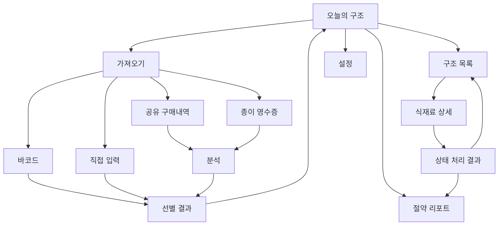
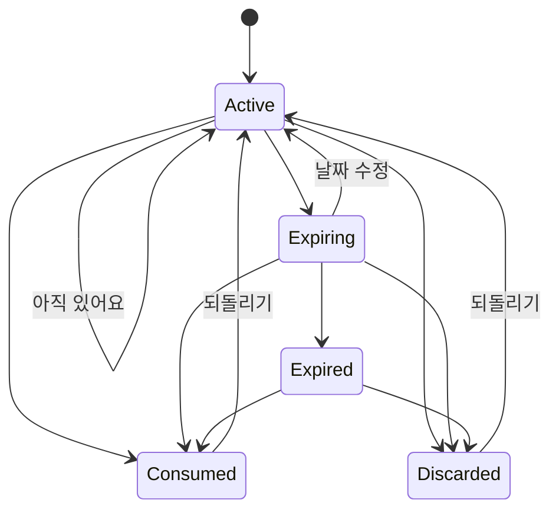

# 냉장고 구조대 사용자 흐름

## 1. 내비게이션 구조



하단 내비게이션은 `홈`, `구조`, `리포트` 세 영역으로 제한한다. 설정은 홈 상단 프로필 버튼으로 진입한다.

## 2. 주 흐름: 구매내역 공유

### 시작 조건

- 사용자가 온라인 마트, 이메일, 전자영수증 또는 사진 앱에서 구매내역을 보고 있다.
- 공유 콘텐츠 형식이 이미지, PDF 또는 텍스트다.

### 정상 흐름

1. 사용자가 Android 공유 메뉴에서 `냉장고 구조대`를 선택한다.
2. 앱은 공유 콘텐츠를 임시 초안으로 저장한다.
3. 분석 화면에서 품목 추출과 자동 선별 진행 상태를 보여준다.
4. 결과를 세 그룹으로 나눈다.
   - 관리 후보
   - 확인 필요
   - 기본 제외
5. 관리 후보는 기본 선택 상태다.
6. 사용자는 필요하면 후보를 제외하거나 확인 필요 항목을 추가한다.
7. `선택한 N개 담기` 버튼으로 한 번에 저장한다.
8. 홈에 저장 결과와 실행 취소를 보여준다.

### UX 원칙

- 품목별로 보관 위치와 날짜를 반드시 입력하게 하지 않는다.
- 날짜가 없으면 카테고리 예상값을 사용하거나 날짜 미정으로 저장한다.
- 분석 중 사용자가 다른 앱으로 이동해도 초안을 잃지 않는다.
- 제외된 생활용품과 장기보관 식품의 개수는 알려주되 화면을 차지하지 않는다.

## 3. 첫 사용과 반복 사용

### 첫 사용

```text
앱 가치 설명
→ 알림은 나중에 요청
→ 데모 구매내역 또는 직접 공유
→ 첫 일괄 저장 성공
→ 홈에서 오늘의 구조 확인
```

- 초기 권한 화면을 연속으로 보여주지 않는다.
- 카메라 권한은 `영수증 촬영`을 눌렀을 때 요청한다.
- 알림 권한은 첫 임박 재료가 저장된 뒤 사용 이유와 함께 요청한다.

### 반복 사용

```text
구매내역 공유
→ 이전 선호 반영
→ 자동 후보 일괄 확인
→ 저장 완료
```

- 이전에 항상 제외한 품목은 기본 제외로 제안한다.
- 이전에 선택한 보관 위치와 예상 기간을 재사용한다.
- 같은 상품의 기존 활성 항목이 있으면 중복 가능성을 표시한다.

## 4. 보조 입력 흐름

### 종이 영수증

1. 재료 추가에서 `영수증 촬영`을 선택한다.
2. ML Kit Document Scanner가 촬영·자동 보정·미리보기를 제공한다.
3. 한국어 Text Recognition으로 품목 후보를 추출한다.
4. 공유 구매내역과 같은 선별 결과 화면으로 이동한다.

대체 흐름:

- Document Scanner 미지원 → 시스템 카메라 또는 사진 선택기
- OCR 결과 없음 → 다시 촬영 또는 직접 입력
- 일부만 인식 → 인식된 항목은 유지하고 직접 추가 가능

### 바코드

1. 바코드를 스캔한다.
2. 상품 DB에 정보가 있으면 이름을 제안한다.
3. GS1 2D 코드에 소비기한이 있으면 날짜 근거와 함께 제안한다.
4. 상품 정보가 없으면 바코드 값은 유지하고 이름을 입력한다.

바코드는 한 품목씩 처리해야 하므로 기본 경로로 강조하지 않는다.

### 직접 입력

최소 입력은 이름 하나다.

```text
이름 입력
→ 최근 보관 위치·카테고리 제안
→ 날짜는 선택 사항
→ 저장
```

## 5. 오늘의 구조 흐름

### 홈 우선순위

```text
1. 오늘 또는 이미 지난 개봉 식품
2. D-1 이내 표시 날짜 품목
3. D-3 이내 앱 예상 품목
4. 사용자가 고정한 품목
5. 날짜 확인이 필요한 오래된 품목
```

홈 카드에는 다음만 표시한다.

- 품목명
- 보관 위치
- `오늘`, `D-1`, `예상 D-3`, `날짜 확인` 중 하나
- 상세 진입 버튼

### 상태 처리



`기한 지남` 화면에서도 먹을 수 없다고 단정하지 않는다. 상태를 직접 확인하도록 안내한다.

## 6. 알림 흐름

### 요약 알림

```text
오늘 먼저 먹을 재료가 3개 있어요
시금치 · 두부 · 우유

[확인하기]
```

품목별 알림을 여러 개 보내지 않는다. 사용자가 알림을 열면 최신 Room 데이터로 다시 계산한 구조 큐를 보여준다.

### 빠른 상태 확인

임박 재료가 오래 응답되지 않았을 때:

```text
두부가 아직 냉장고에 있나요?

[먹었어요] [아직 있어요] [버렸어요]
```

- 응답이 없으면 자동으로 먹음이나 버림 처리하지 않는다.
- 일정 기간 뒤 `확인 필요`로 이동한다.
- 알림 권한이 없으면 홈에 같은 질문을 표시한다.

## 7. 화면별 상태

| 화면 | Loading | Empty | Content | Partial | Failure |
|---|---|---|---|---|---|
| 오늘의 구조 | DB 초기화 | 구조할 재료 없음 | 임박 카드 | 날짜 확인 카드 포함 | 로컬 읽기 오류 |
| 분석 | 모델 준비 | 해당 없음 | 처리 진행 | 일부 페이지만 성공 | 파일·OCR 오류 |
| 선별 결과 | 분류 중 | 식재료 후보 없음 | 세 그룹 결과 | 일부 품목 불확실 | 초안 복구 실패 |
| 구조 목록 | DB 로딩 | 활성 재료 없음 | 목록 | 동기화 대기 배지 | 로컬 읽기 오류 |
| 리포트 | 집계 중 | 기록 없음 | 통계 | 가격 일부만 존재 | 집계 오류 |

오류 화면은 사용자가 다음 행동을 할 수 있어야 한다. 단순 `다시 시도`만 제공하지 않는다.

## 8. 뒤로 가기와 복구

| 상황 | 처리 |
|---|---|
| 분석 중 뒤로 가기 | 취소 확인 후 입력 선택으로 이동, 초안 유지 |
| 선별 결과에서 뒤로 가기 | 분석 결과 유지 |
| 선별 결과에서 앱 종료 | 다음 실행 시 초안 복구 제안 |
| 저장 직후 뒤로 가기 | 중복 저장하지 않고 홈 이동 |
| 상태 완료 화면에서 뒤로 가기 | 구조 목록으로 이동 |
| 외부 공유로 이미 실행 중인 앱 진입 | 새 초안을 만들고 가져오기 화면을 전면 표시 |

## 9. 접근성 요구사항

- 색상만으로 임박도와 선택 상태를 표현하지 않는다.
- 화면 리더는 `시금치, 냉장 채소칸, 앱 예상 D-1, 상세 보기` 순서로 읽는다.
- 최소 터치 영역은 48dp다.
- 글자 크기 200%에서도 주요 버튼과 날짜가 잘리지 않아야 한다.
- 애니메이션 감소 설정에서는 스캔·완료 모션을 축소한다.
- 넓은 화면에서는 구조 목록과 상세를 동시에 보여주되 동일한 선택 상태를 유지한다.

## 10. 프로토타입 검증 과제

사용자 테스트에서 다음을 확인한다.

1. 사용자가 `공유해서 담기`를 기존 마트 앱에서 시작하는 기능으로 이해하는가?
2. 자동 제외된 품목을 쉽게 확인하고 신뢰할 수 있는가?
3. `앱 예상 D-3`와 실제 포장 날짜를 구분하는가?
4. 품목을 저장하기 전에 수정해야 한다는 부담을 느끼는가?
5. `먹었어요`, `아직 있어요`, `버렸어요` 중 선택이 자연스러운가?
6. 절약 리포트가 죄책감보다 다음 행동을 돕는가?
